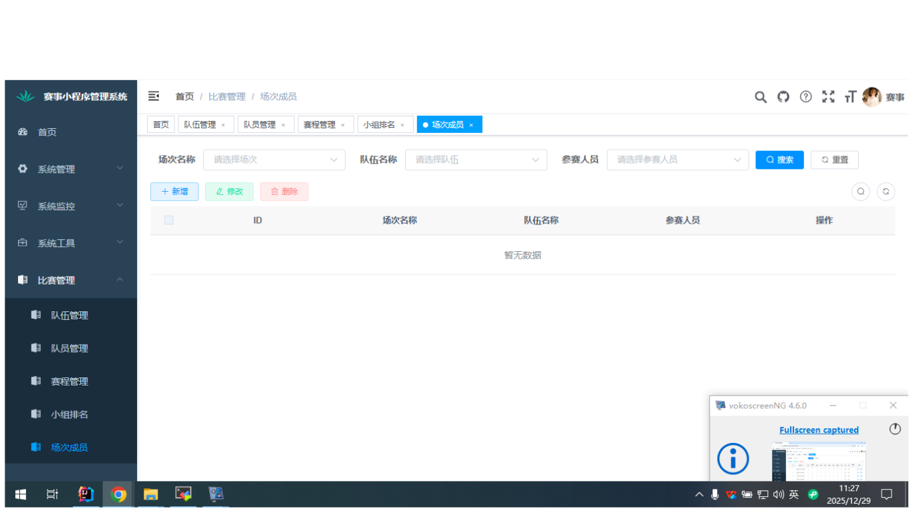
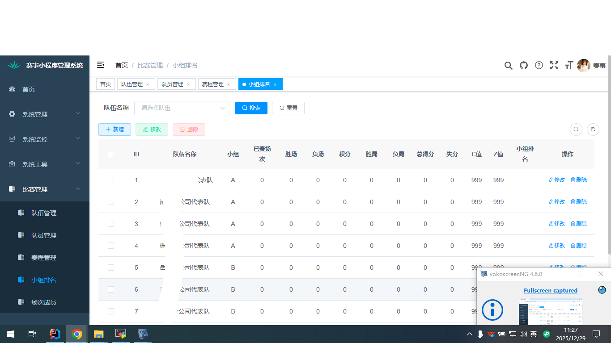
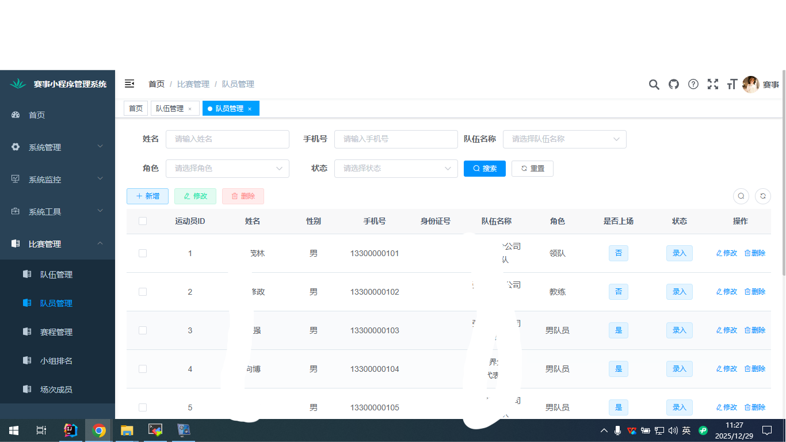
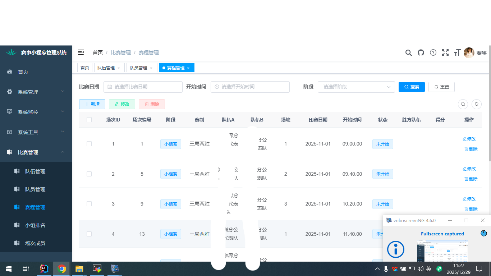

# 赛事小程序项目介绍

## 项目概述

本项目是基于[RuoYi-Vue](https://gitee.com/y_project/RuoYi-Vue)开源框架开发的一套体育比赛活动管理系统，采用前后端分离架构，包含后端管理系统和微信小程序前端展示系统。系统主要用于体育比赛活动的全流程管理，从前端活动展示、报名、签到到后端的比赛管理、成绩统计等功能。

## 技术架构

- 后端框架：Spring Boot、Spring Security、MyBatis、Redis等
- 前端框架：Vue、Element UI
- 小程序端：微信小程序
- 数据库：MySQL
- 开发工具：IntelliJ IDEA、Visual Studio Code

## 核心功能模块

### 后端管理系统

1. **活动信息管理**
   - 活动创建、编辑、删除
   - 活动基本信息维护（名称、时间、地点、主办方等）
   - 活动状态管理（未开始、进行中、已结束）

2. **参赛人员管理**
   - 运动员信息管理
   - 团队信息管理
   - 参赛资格审核

3. **比赛场次管理**
   - 比赛场次安排
   - 对阵双方配置
   - 比赛时间地点设置

4. **报名管理**
   - 报名信息审核
   - 报名统计分析
   - 签到管理

5. **成绩排名管理**
   - 比赛成绩录入
   - 实时积分榜展示
   - 排名统计分析

6. **通知公告管理**
   - 发布赛事相关信息
   - 重要通知推送

### 微信小程序前端

1. **活动浏览**
   - 展示所有体育比赛活动
   - 活动详情查看
   - 活动筛选和搜索

2. **在线报名**
   - 用户报名参加活动
   - 报名信息填写
   - 报名状态查询

3. **活动签到**
   - 扫码签到功能
   - 签到记录查询

4. **比赛信息查询**
   - 赛程安排查看
   - 比赛对阵情况
   - 比赛成绩查询

5. **积分排行榜**
   - 实时积分榜展示
   - 个人/团队排名查询

## 项目特点

1. **完整的赛事管理流程**：覆盖从活动发布到比赛结束的完整生命周期
2. **多端协同**：后台管理系统与微信小程序前端无缝对接
3. **灵活配置**：支持多种比赛类型和赛制配置
4. **实时更新**：比赛成绩和排名实时更新展示
5. **用户体验优化**：界面简洁友好，操作便捷流畅

## 适用场景

该系统适用于各类体育比赛活动的组织和管理，包括但不限于：
- 学校体育赛事
- 社区运动会
- 企业团建活动
- 业余联赛组织

通过该系统，管理员可以高效地管理赛事活动全过程，参赛者可以通过微信小程序方便地获取赛事信息、报名参赛和参与活动，大大提升了体育赛事活动的组织效率和参与体验。

## 系统截图

## 关注我们

如果您对我们的项目感兴趣或希望了解更多技术内容，请关注我们的公众号：

**SpringBoot之小韦**

欢迎扫码关注，获取更多技术干货和项目更新！